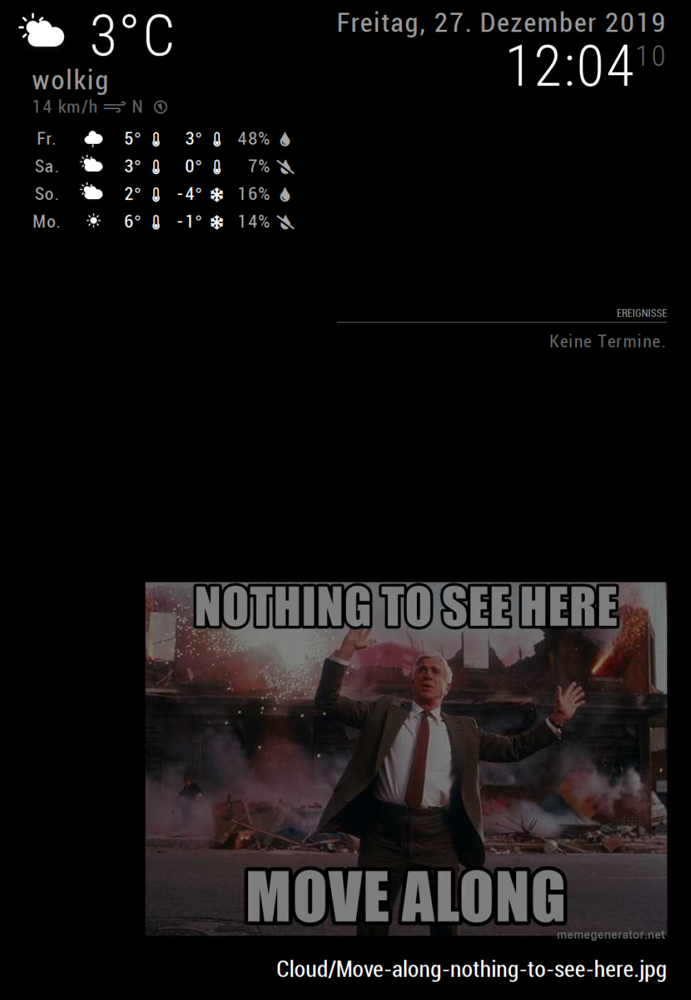

# MagicMirror Module: MMM-Random-local-image

A MagicMirror Module to show random images from a local folder on the Mirror.

I for example mounted the images from a private cloud (which could be accessed as NFS).

## Screenshots

Displaying image with additional information (path to the file)



## Installation

In your terminal, go to your MagicMirror's Module folder:

```
cd ~/MagicMirror/modules
git clone https://github.com/miccl/MMM-Random-local-image.git
cd MMM-Random-local-image
npm ci
```

Configure the module in the `config.js` file.

## Using the module

To use this module, add it to the modules array in the `config/config.js` file:

```javascript
modules: [
  {
    module: "MMM-Random-local-image",
    position: "fullscreen_below",
    config: {
	  photoDir: "./modules/MMM-Random-local-image/exampleImages",
	  // below are more options
    },
  },
];
```

## Configuration options

The following properties can be configured:

| Option                     | Description                                                                                                                                                                                                |
| -------------------------- | ---------------------------------------------------------------------------------------------------------------------------------------------------------------------------------------------------------- |
| `photoDir`                 | Local path to your photos. root dir is Magic-Mirror root directory. <br><br> **Possible Values:** Local path                                                                                               |
| `photoUpdateInterval`      | How often a new photo is displayed <br><br> **Possible Values:** A positive number of milliseconds <br> **Default value:** 1 _ 30 _ 1000 (every 30 seconds)                                                |
| `photoLoadInitialDelay`    | Initial delay of the image loading <br><br> **Possible Values:** A positive number of milliseconds <br> **Default value:** 1 \* 1000 (1 second)                                                            |
| `photoLoadUpdateInterval`  | Time between loading images <br><br> **Possible Values:** A positive number of milliseconds <br> **Default value:** 12 _ 60 _ 60 \* 1000 (every 12 hours)                                                  |
| `randomOrder`              | Display images in random order <br><br> **Possible Values:** `true` or `false` <br> **Default value:** `true`                                                                                              |
| `opacity`                  | Opacity of the image <br><br> **Possible Values:** 0.0 to 1.0 <br> **Default value:** 1.0                                                                                                                  |
| `photoDir`                 | Local path to your photos. root dir is Magic-Mirror root directory. <br><br> **Possible Values:** Local path <br> **Default value:** ./modules/MMM-Random-local-image/photos/                              |
| `showAdditionalInformation`       | Show image meta info. <br><br> **Possible Values:** `true` or `false` <br> **Default value:** `true`                                                                                                       |
| `selectFromSubdirectories` | The images are not selected from root dir (all possible images), but from a random subdirectory inside the root directory. <br><br> **Possible Values:** `true` or `false` <br> **Default value:** `false` |
| `ignoreDirRegex` | Regex for ignoring specifc subdirectories. Only in combiniation with selectFromSubdirectories 0 `true` <br><br> **Possible Values:** Regex expression <br> **Default value:** No ignored directories |
